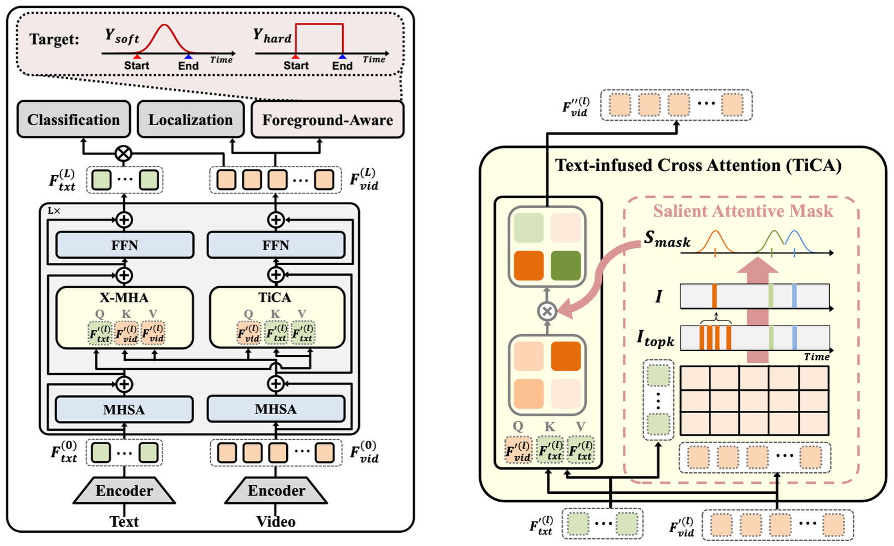

# [NeurIPS 2024] Text-Infused Attention and Foreground-Aware Modeling for Zero-Shot Temporal Action Detection

This repository contains the official implementation code for the NeurIPS 2024 paper "Text-Infused Attention and Foreground-Aware Modeling for Zero-Shot Temporal Action Detection".



# Installation
1. Install the required packages
```bash
pip install  -r requirements.txt
```

2. Install NMS
```bash
cd ./libs/utils
python setup.py install --user
cd ../..
```

# Data Preparation
- We utilize the feature for THUMOS14 and ActivityNet datasets from [ActionFormer](https://github.com/happyharrycn/actionformer_release) repository. 
- Please download these features using their link and extract them to the ./data folder.


# Training and Evaluation
```bash
python train_eval.py ./configs/anet_i3d.yaml --output <output_name> --n <num_split>
```

# Evaluation
```bash
python eval.py ./configs/anet_i3d.yaml ./ckpt/anet_i3d_<data_split>_<num_split>/ --n <num_split>
```

# Acknowledgement
The codebase is based on [ActionFormer](https://github.com/happyharrycn/actionformer_release) and [GroundingDINO](https://github.com/IDEA-Research/GroundingDINO). We thanks the authors for their efforts.

# Citation
```bash
@article{lee2024text,
  title={Text-Infused Attention and Foreground-Aware Modeling for Zero-Shot Temporal Action Detection},
  author={Lee, Yearang and Kim, Ho-Joong and Lee, Seong-Whan},
  journal={Advances in Neural Information Processing Systems},
  volume={37},
  pages={9864--9884},
  year={2024}
}
```